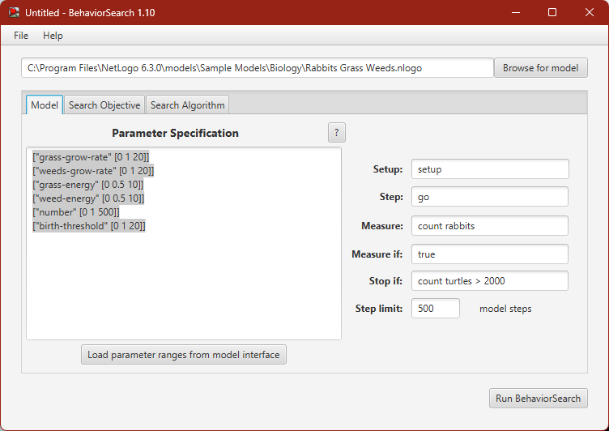

## Комп'ютерні системи імітаційного моделювання
## СПм-23-5, **Хромов Нікіта Олексійович**
### Лабораторна робота №3. 
## Використання засобів обчислювального интелекту для оптимізації імітаційних моделей

 

### Варіант 6, модель у середовищі NetLogo:
[Rabbits Grass Weeds](http://www.netlogoweb.org/launch#http://www.netlogoweb.org/assets/modelslib/Sample%20Models/Biology/Rabbits%20Grass%20Weeds.nlogo)

 

### Вербальний опис моделі:
Проста екосистема, де кролики блукають хаотично, а трава та бур'яни ростуть безладно. Коли кролик знаходить траву чи бур'ян, він споживає їх, отримуючи енергію. Розмноження кроликів залежить від отриманої енергії, в той час як нестача енергії призводить до їхньої загибелі. Можливе налаштування швидкості зростання трави та бур'янів, а також їхньої енергетичної цінності, що дозволяє досліджувати конкурентні переваги цих змінних у рамках моделі.

Керуючі параметри:
- **number** – визначає кількість кролів.
- **birth-threshold** - встановлює рівень енергії, при досягненні якого кролики починають розмножуватися.
- **Grass-Growth-Rate** – регулює швидкість росту трави.
- **weeds-growth-rate** – керує темпом розвитку бур'янів.
- **grass-energy** – кількість енергії, що отримується від поїдання трави.
- **weed-energy** - енергія, що отримується від поїдання бур'янів.

### Показники роботи системи:
- **count rabbits** – поточна кількість кроликів.
- **Population** – діаграма, що відображає кількісні властивості трави, кроликів, бур'янів.

 

### Налаштування середовища BehaviorSearch:

**Обрана модель**:
<pre>
C:\Program Files\NetLogo 6.3.0\models\Sample Models\Biology\Rabbits Grass Weeds.nlogo
</pre>
**Параметри моделі** (вкладка Model):  
*Параметри та їх модливі діапазони були **автоматично** вилучені середовищем BehaviorSearch із вибраної імітаційної моделі, для цього є кнопка «Завантажити діапазони параметрів із інтерфейсу моделі»*:
<pre>
["grass-grow-rate" [0 1 20]]
["weeds-grow-rate" [0 1 20]]
["grass-energy" [0 0.5 10]]
["weed-energy" [0 0.5 10]]
["number" [0 1 500]]
["birth-threshold" [0 1 20]]
</pre>
*Кількість машин було знижено мною, в порівнянні зі значенням за замовчуванням, для скорочення часу симуляції, оскільки налаштування цієї моделі демонструвалося на лекції і був сенс не затягувати необхідний для аналізу час.*  
Використовувана **міра**:  
Для фітнес-функції *(вона ж функція пристосованості або цільова функція)* було обрано **значення кількості кроликів**, вираз для її розрахунку взято з налаштувань графіка аналізованої імітаційної моделі в середовищі NetLogo та вказано у параметрі "**Measure**":
<pre>
count rabbits
</pre>
Кількість кроликів повинна враховуватися **в середньому** за весь період симуляції тривалістю, 500 тактів , починаючи з 0 такту симуляції.  
*Параметр "**Mesure if**" зі значення true, по суті, і означає, що враховуватимуться всі такти симуляції, а чи не частина їх. Іноді має сенс не враховувати деякі такти через хаос в деяких моделях на початку їх використання. Наприклад, це показано в прикладі з документації BehaviorSearch.  
Параметри "**Setup**" та "**Go**" вказують відповідні процедури ініціалізації та запуску в логіці моделі (зазвичай вони так і називаються). BehaviorSearch в процесі роботи, по суті, замість користувача запускає ці процедури.*  
Параметр зупинки за умовою ("**Stop if**") у разі не використовувався.  
Загальний вигляд вкладки налаштувань параметрів моделі:  

**Налаштування цільової функції** (вкладка Search Objective):  
Метою підбору параметрів імітаційної моделі, є **максимізація** значення – це вказано через параметр "**Goal**" зі значенням **Maximize Fitness**. Для цього у параметрі "**Collected measure**", що визначає спосіб обліку значень обраного показника, вказано **MEAN_ACROSS_STEPS**.  
Щоб уникнути викривлення результатів через випадкові значення, що використовуються в логіці самої імітаційної моделі, **кожна симуляція повторюється по 10 разів**, результуюче значення розраховується як **середнє арифметичне**. *Якщо вважаєте вплив випадковості на те, що відбувається в обраній вами імітаційній моделі незначним - то повторні симуляції можуть бути і не потрібні.*  
Загальний вигляд вкладки налаштувань цільової функції:  

**Налаштування алгоритму пошуку** (вкладка Search Algorithm):  
Загальний вид вкладки налаштувань алгоритму пошуку:  

 

### Результати використання BehaviorSearch:
Діалогове вікно запуску пошуку *(можна залишити за замовчуванням, але стежте, куди пишеться результат)*:  

Результат пошуку параметрів імітаційної моделі, використовуючи **генетичний алгоритм**:  

Результат пошуку параметрів імітаційної моделі, використовуючи **випадковий пошук**:  

Різниця у тому, що у випадку *випадкового пошуку* знадобилося більше часу, а значення фітнес-функції було менше ніж у випадку використання *Генетичного алгоритму*.
